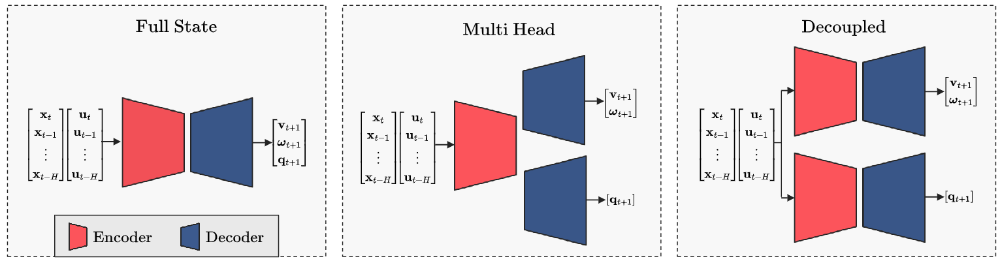

# Learning Long-Horizon Predictions for Quadrotor Dynamics
This github repository contains the codebase accompanying the paper **Learning Long-Horizon Predictions for Quadrotor Dynamics** by [Pratyaksh Prabhav Rao](https://scholar.google.com/citations?user=_Vy11KoAAAAJ&hl=en&oi=sra), [Alessandro Saviolo](https://scholar.google.com/citations?user=HaOQ8AoAAAAJ&hl=en), [Tommaso Castiglione Ferrari](), and [Giuseppe Loianno](https://scholar.google.com/citations?user=W8f0d6oAAAAJ&hl=en&oi=ao).

